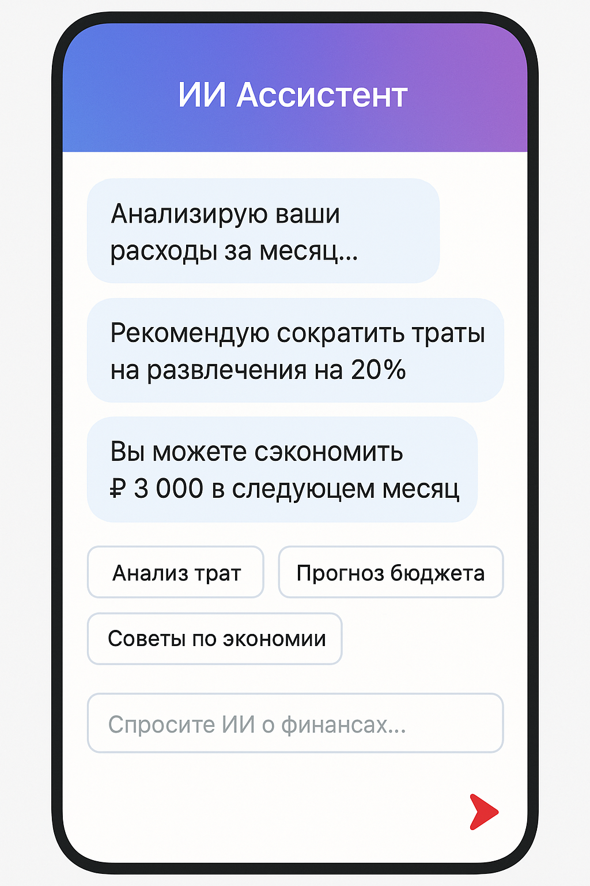

# 💰 FinAIce - Умное управление финансами с ИИ

> **FinAIce** = Finance + AI - современное приложение для управления личными финансами с мощными возможностями искусственного интеллекта, созданное в стиле популярного Budget OK.


## 🌟 Особенности

### 🎨 **Дизайн как в Budget OK**
- **Идентичный интерфейс** - точная копия популярного Budget OK
- **Минималистичный дизайн** - чистый белый фон с красными акцентами
- **Круглые иконки категорий** - интуитивно понятная навигация
- **Мобильная адаптивность** - отлично работает на всех устройствах

### 🤖 **ИИ-возможности**
- **Умная категоризация** - автоматическое определение категории транзакций
- **Персональные советы** - ИИ анализирует ваши траты и дает рекомендации
- **Чат-ассистент** - отвечает на вопросы о финансах и помогает планировать бюджет
- **Прогнозирование** - предсказывает возможности экономии

### 📊 **Функциональность**
- **Учет доходов и расходов** - полный контроль финансов
- **Аналитика с диаграммами** - визуализация трат по категориям
- **Баланс в реальном времени** - актуальная информация о состоянии счетов
- **История транзакций** - детальный журнал всех операций

## 🚀 Быстрый старт

### Требования
- Node.js 18+
- Python 3.11+
- Git

### Установка

1. **Клонируйте репозиторий**
```bash
git clone https://github.com/nasyryllauly/finaice.git
cd finaice
```

2. **Запуск Backend**
```bash
cd backend
python -m venv venv
source venv/bin/activate  # Linux/Mac
# или venv\Scripts\activate  # Windows
pip install -r requirements.txt
python src/main.py
```

3. **Запуск Frontend**
```bash
cd frontend
npm install
npm run dev
```

4. **Инициализация данных**
```bash
curl -X POST http://localhost:5003/api/init-data
```

5. **Откройте приложение**
```
http://localhost:5173
```

## 📱 Экраны приложения

### Главный экран

- Общий баланс
- ИИ-советы
- Последние транзакции

### Добавление транзакций

- Сетка категорий как в Budget OK
- ИИ-предложения категорий
- Быстрое добавление

### ИИ-ассистент

- Чат с финансовым ИИ
- Быстрые действия
- Персональные рекомендации

## 🏗️ Архитектура

### Frontend
- **React 18** - современный UI фреймворк
- **Vite** - быстрая сборка и разработка
- **Tailwind CSS** - утилитарные стили
- **Lucide React** - иконки

### Backend
- **Flask** - легкий веб-фреймворк
- **SQLAlchemy** - ORM для работы с БД
- **SQLite** - встроенная база данных
- **Flask-CORS** - поддержка CORS

### ИИ-сервисы
- **Автокатегоризация** - анализ текста транзакций
- **Генерация инсайтов** - персональные рекомендации
- **Чат-бот** - ответы на финансовые вопросы

## 📁 Структура проекта

```
finaice/
├── frontend/           # React приложение
│   ├── src/
│   │   ├── components/ # Компоненты экранов
│   │   ├── services/   # API интеграция
│   │   └── App.jsx     # Главный компонент
│   ├── index.html
│   └── package.json
├── backend/            # Flask API
│   ├── src/
│   │   ├── models/     # Модели данных
│   │   ├── routes/     # API endpoints
│   │   └── main.py     # Точка входа
│   └── requirements.txt
├── docs/               # Документация
├── assets/             # Изображения и ассеты
└── README.md
```

## 🔌 API Endpoints

### Транзакции
- `GET /api/transactions` - получить транзакции
- `POST /api/transactions` - создать транзакцию
- `GET /api/categories` - получить категории

### Аналитика
- `GET /api/analytics/summary` - сводка по финансам

### ИИ
- `GET /api/ai/insights` - получить ИИ-советы
- `POST /api/ai/chat` - чат с ИИ-ассистентом

## 🎯 Особенности ИИ

### Умная категоризация
```javascript
// Автоматически определяет категорию по описанию
"Обед в кафе" → "Еда" (90% уверенности)
"Поездка на такси" → "Транспорт" (85% уверенности)
```

### Персональные инсайты
- Анализ паттернов трат
- Рекомендации по экономии
- Предупреждения о превышении бюджета
- Прогнозы на следующий месяц

### Чат-ассистент
- Отвечает на вопросы о финансах
- Дает советы по планированию бюджета
- Помогает анализировать расходы

## 🛠️ Разработка

### Добавление новых категорий
```python
# В backend/src/routes/transactions.py
new_category = Category(
    name='Новая категория',
    icon='🆕',
    color='bg-blue-500',
    type='expense'
)
```

### Расширение ИИ-функций
```python
# В AIService класс
def new_ai_feature(self, data):
    # Ваша логика ИИ
    return result
```

## 📄 Лицензия

MIT License - см. [LICENSE](LICENSE)

## 🤝 Участие в разработке

1. Fork проекта
2. Создайте feature branch (`git checkout -b feature/amazing-feature`)
3. Commit изменения (`git commit -m 'Add amazing feature'`)
4. Push в branch (`git push origin feature/amazing-feature`)
5. Откройте Pull Request

## 📞 Поддержка

Если у вас есть вопросы или предложения:
- Создайте [Issue](https://github.com/nasyryllauly/finaice/issues)
- Напишите в [Discussions](https://github.com/nasyryllauly/finaice/discussions)

---

**FinAIce** - где встречаются традиционное управление финансами и современный ИИ! 🚀✨

